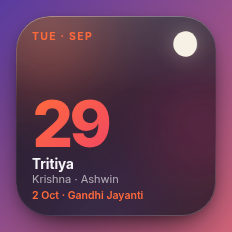
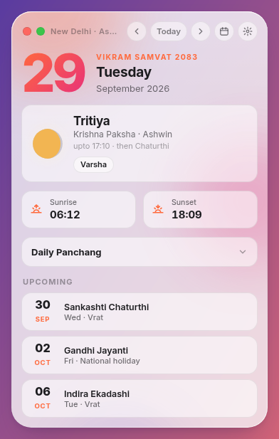
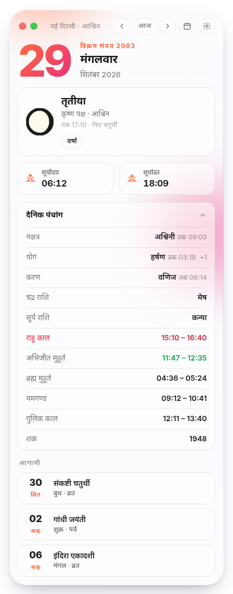
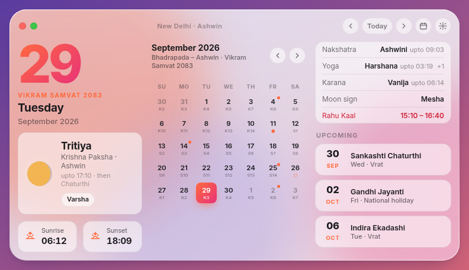

<p align="center">
  
</p>

<h1 align="center">🕉 Ats's Hindu Calendar Widget</h1>

<p align="center">
  <strong>A glass-style desktop widget for the Hindu Panchang, calculated for India.</strong>
</p>

<p align="center">
  
  
  
</p>

---

<p align="center">
  
  
  
</p>
<p align="center"></p>

## ✨ Features

- 📅 **Real Panchang, calculated on your device.** Tithi, Nakshatra, Yoga and Karana with their end times, plus Paksha, Hindu month, Ritu, Vikram and Shaka Samvat, and Moon/Sun rashi.
- 🌅 **Sunrise and sunset** for 44 Indian cities, all in IST.
- ⏰ **Muhurat and kaal:** Brahma Muhurat, Abhijit, Rahu Kaal, Yamaganda and Gulika.
- 🎉 **Festivals and vrats** worked out from tithi rules, so no yearly data file is needed. Covers Diwali, Holi, Navratri, Janmashtami, Ganesh Chaturthi, Karva Chauth, Chhath, the Sankrantis, all 24 named Ekadashis, Pradosh, Sankashti, Purnima and Amavasya. Adhik Maas is handled.
- 🗓 **Month view** with the tithi and festival markers on each day.
- 🪟 **Three layouts:** Compact (200²), Standard, and Wide (a dashboard with the month grid).
- 🌗 **Light, Dark or Auto theme** (follows the system), with Liquid Glass styling and 7 accent colours.
- 🌐 **English and Hindi.**
- 📌 **Always on Top** that works on Windows, macOS (including over full-screen apps) and Linux X11/XWayland.
- 🚀 **Start at login** on all three OSes. It is on by default; turn it off in Settings or from the tray.
- 🔒 Lock position, remembers where you left it, and works fully offline (fonts are bundled).

### Accuracy

- Sun and Moon positions use Meeus, *Astronomical Algorithms* (ch. 25 and 47). Sidereal positions use the Lahiri ayanamsa.
- Tithi end times match drikpanchang.com (New Delhi) to the minute.
- Festival dates for 2025 and 2026 are checked against Drik Panchang in `test/panchang.test.js`.
- Ekadashi uses the udaya-tithi (Vaishnava) rule. Regional customs can differ by a day.

## 📦 Download

Get the latest build from **[Releases](https://github.com/atishsharma/ats-hindu-calendar-widget/releases)**:

| OS | File |
|----|------|
| Windows | `Ats-Hindu-Calendar-Setup-x.y.z-x64.exe` (installer) or `…-Portable-…exe` |
| macOS (Intel / Apple Silicon) | `Ats-Hindu-Calendar-x.y.z-mac-x64.dmg` / `…-mac-arm64.dmg` |
| Linux | `.AppImage`, `.deb`, `.tar.gz` |

**macOS:** the build is not notarized. After copying it to Applications, run
`xattr -cr "/Applications/Ats Hindu Calendar.app"` once, or right-click the app and choose **Open**.

**Linux:** always-on-top needs X11 or XWayland, and the app switches to XWayland automatically.
Set `ATS_NATIVE_WAYLAND=1` to force native Wayland; always-on-top won't work there.
The tray needs an AppIndicator extension on GNOME. Every tray action is also available in the widget's Settings.

## 🚀 Development

```bash
git clone https://github.com/atishsharma/ats-hindu-calendar-widget.git
cd ats-hindu-calendar-widget
npm install
npm start            # use `npm run start:nosandbox` on Ubuntu 24.04+
npm test             # astronomy + festival date tests
```

To preview the UI in a browser, open `src/renderer/index.html?layout=wide&theme=light&lang=hi`.

### Building

```bash
npm run dist:linux   # AppImage, deb, tar.gz
npm run dist:win     # NSIS installer + portable (run on Windows)
npm run dist:mac     # dmg + zip, x64 + arm64 (run on macOS)
```

`.github/workflows/release.yml` builds on all three OSes for every push and PR.
A GitHub Release `v<version>` is published when a new `package.json` version lands on `main`, or when a `v*` tag is pushed.

## 📁 Structure

```
src/
├── lib/panchang.js      # astronomy + panchang + festival engine (no dependencies)
├── main/main.js         # window, always-on-top, tray, autostart, settings
├── main/preload.js      # IPC bridge
└── renderer/            # UI (index.html, styles.css, app.js, bundled fonts)
build/                   # icons (.ico/.icns/.png), afterPack hook, NSIS script
icons/                   # Linux icon set
test/                    # node:test suite
mockups/                 # design mockup
```

## 📄 License

MIT. Fonts: Inter and Noto Sans Devanagari, both under the SIL OFL 1.1.

## 👨‍💻 Developer

**Atish Ak Sharma** · [atishaksharma.com](https://atishaksharma.com) · [@atishsharma](https://github.com/atishsharma)
